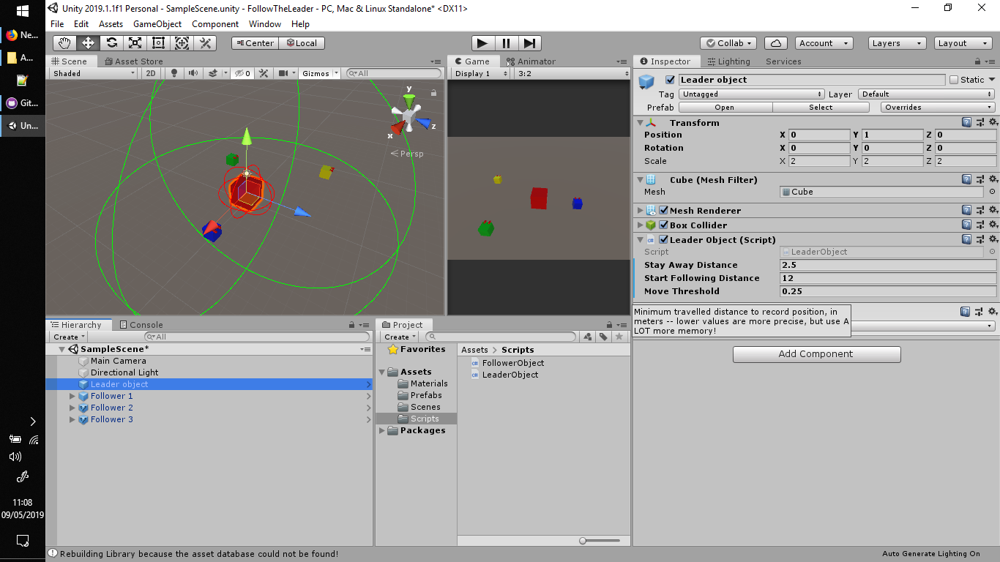
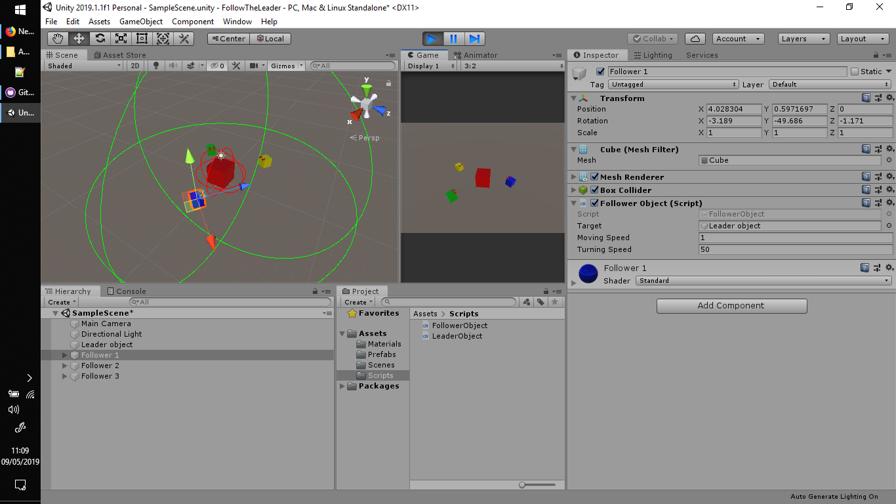

# FollowTheLeader
Unity demo scripts where gameobjects follow the same path the leader did

This demo project is an answer for this demand:
https://gamedev.stackexchange.com/questions/171698/how-to-make-an-object-track-another-objects-exact-movements

It's an alternative for the user of timers; you have a Leader object, which walks a path. And you have a variable number of Followers,
which have to follow the leader's path. The problem, however, involves different movement speeds for the followers (they are slower 
than the leader). They also rotate towards the leader's position.

The leader has a radius that determines how far from it they will follow (they will "forget" it when they see it can't be reached), 
represented by the green wired sphere. It also has a "stay away" radius, represented by the red one. 

There are few parameters, to keep the code simple, but if someone would like something fancier, feel free to ask (PM me).

Cheers!

